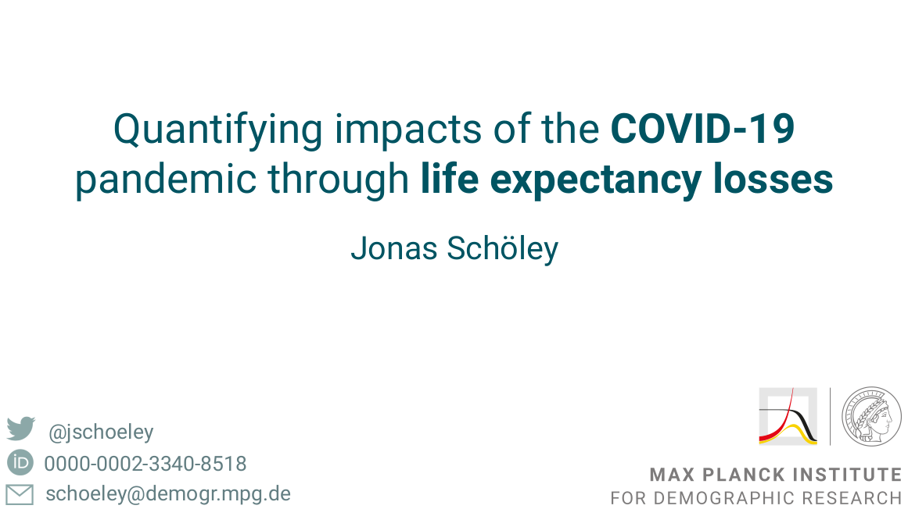

# Presentation: Quantifying impacts of the COVID-19 pandemic through life expectancy losses

- Where: [IUSSP](https://iussp.org/en/2021-international-population-conference-ipc2021)
- When: 5-10 December 2021

Jonas Schöley (presenter) with José Manuel Aburto, Ilya Kashnitsky, Luyin Zhang, Charles Rahal, Trifon I Missov, Melinda C Mills, Jennifer B Dowd, and Ridhi Kashyap

